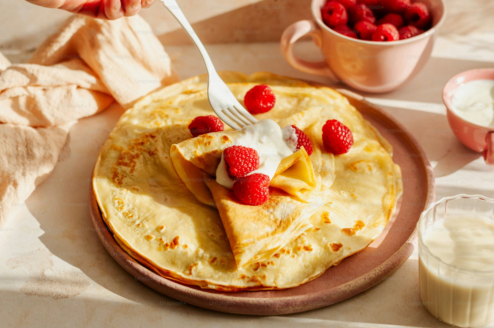

# Pancake Recipe Page 2.0
---
An updated version of the pancake recipe page that I've previously made as part of an front-end web development course. The old version can be seen here: [Pancake Recipe Page](https://github.com/leo98lxl/pancake-recipe)
## Features
This recipe page includes new features that I learned throughout the course, such as:
- Semantic HTML code for improved accessibility. For example, replacing this:
  ```html
  <div class="recipe-box">
        
            <div class="recipe-content">
                <h1 class="recipe-title">Enkelt recept på pannkakor</h1>
                <div class="recipe-description">
                    <p>Gör traditionella tunna pannkakor med detta enkla och goda pannkaksrecept.</p>
                </div>
  ```
  With this: 
  ```html
  <section class="recipe__top">
            <figure>
                
            </figure>
        </section>
                <section class="recipe__title">
                    <h1 class="recipe__title--heading">Enkelt recept på pannkakor</h1>
                </section>
                <section class="recipe__description">
                    <p class="recipe__description--text">Gör traditionella tunna pannkakor med detta enkla och goda pannkaksrecept!</p>
                </section>
  ```
- A header for page navigation and user log-in.
- A Recipe page that shows other recipes.
- A Contact page for uploading recipes using a form.
- Improved responsiveness to web pages, mainly from the implementation of CSS flex and grid.
- Improved CSS for a prettier look and better code structure, such as using variables. For instance, going from this:
  ```css
  body {
    font-family: "Open Sans", sans-serif;
    background-color: #A100004D;
    padding-bottom: 64px;
  }
  ```
  To this:
  ```css
  body {
    font-family: var(--ff-main); 
    background-color: var(--clr-pink); 
    padding-block-end: calc(var(--spc-large) * 2);
    line-height: var(--lh-large);
  }
  ```
## Technologies
- HTML
- CSS
## Known issues (as of August 2026)
- The log-in button lacks functionality.
- The About Us page hasn't been created yet. Clicking on it brings you back to the Home page.
- For resolutions below 900px, the cards on the Recipe page collide with each other.
- Submitting a recipe does nothing, no functionality added yet.
- CSS needs better support for different resolutions.
## What I've learned
- The implementation and purpose of semantic HTML.
- Creating and styling page navigation.
- Creating and styling forms.
- More CSS features, such as improving responsiveness with fewer lines of code.
---
## Author
Created by Leo Leksell.
- [GitHub](https://github.com/leo98lxl)
- [LinkedIn](https://www.linkedin.com/in/leo-leksell-443a50269/)
